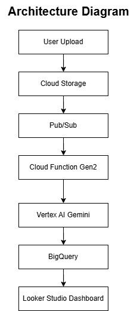

# AI-Powered Media Analytics Platform on Google Cloud Platform

## Architecture



## Overview

An end-to-end serverless media analytics platform built on Google Cloud Platform using Cloud Storage, Pub/Sub, Cloud Functions Gen2, Vertex AI Gemini, BigQuery, and Looker Studio.

## Solution Flow

1. User uploads media files to Cloud Storage
2. Pub/Sub receives upload events
3. Cloud Function Gen2 processes the event
4. Vertex AI Gemini classifies content and generates insights
5. Results are stored in BigQuery
6. Looker Studio visualizes analytics dashboards

## Technologies

- Google Cloud Platform (GCP)
- Terraform
- Python
- Cloud Storage
- Pub/Sub
- Cloud Functions Gen2
- Vertex AI Gemini
- BigQuery
- Looker Studio

## Screenshots

### Cloud Storage


### Pub/Sub


### Cloud Function


### BigQuery


### Dashboard


## Deployment

```bash
terraform init
terraform plan
terraform apply
```

## Skills Demonstrated

- Infrastructure as Code (Terraform)
- Event-Driven Architecture
- Serverless Computing
- AI/ML Integration using Vertex AI Gemini
- Data Analytics using BigQuery
- Dashboard Development using Looker Studio

## Author

Santosh Singh
